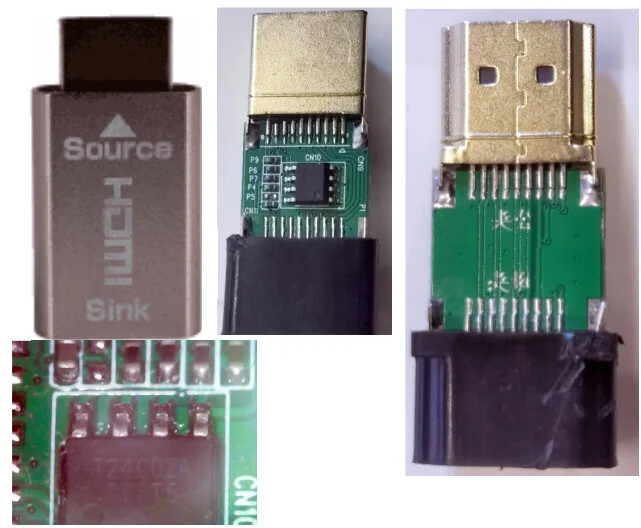

## How to apply modded EDID (most methods are model-agnostic)

#### Permanent variant: apply once to display hardware, use with any source
Note: plug display as a second to a PC via any cable, get it detected in monitors list. Before modding the picture would be black/broken, bad picture does NOT prevent writing modded EDID. Save original EDID backup before changing it.
Software to use:
* Windows + AMD/NVIDIA: Use EDWriter from https://www.monitortests.com/forum/Thread-EDID-DisplayID-Writer
  * Carefully select display to avoid flashing the wrong one, press "Read EDID"
  * Press "Save file...", save backup
  * Press "Load file...", agree if asked, press "Write EDID"
  * Intel GPUs are NOT supported for writing EDID. But they work fine with already modded, so use another PC for modding or use Linux writer (below)
* Linux + AMD/NVIDIA/Intel: Use edid-checked-writer from https://github.com/galkinvv/edid-checked-writer (see manual there)

Possible outcomes:

* If the software succeeds, all done!
* If the software reports that device is write-protected - you will need a trivial extra device (the video signal is passing through) - the so called "HDMI lock emulator" in the role of writeable-EDID-injector between signal source and HDMI cable.
Cheapest one is in a picture below (no need to disassemble it, internals shown below just for reference).
Write EDID into it and always use the monitor with this emulator.

#### Software-level override on a single PC: use as a secondary monitor after OS booted (can't show BIOS)

* Windows: use Custom Resolution Utility from https://www.monitortests.com/forum/Thread-Custom-Resolution-Utility-CRU
  * plug display, start CRU utility, select correct display in the list
  * Use "Import..." button to load custom EDI file, press OK
  * Run "Restart64" utility to force PC rescan monitors
* Linux: 
  * place custom EDID file in `/usr/lib/firmware/edid/NAME.bin`
  * add parameter to kernel cmd line like `drm.edid_firmware=edid/NAME.bin`
  * distribution-specific: you may need adding the above file into list of files packed into initramfs, see https://wiki.archlinux.org/title/Kernel_mode_setting#Forcing_modes_and_EDID

### Limitations for Dual-Link-DVI connections

While *some* Dual-Link-DVI monitor models can be adapted to work from Single-Link/HDMI, *some* others (mostly pre-2010) **truly requires Dual-Link-DVI signal**. They will not work with HDMI->DVI cables or Single-link DVI sources even after EDID flashing.

#### Hardware-level limitations for Dual-Link-DVI

If the monitor signal decoder truly can't handle single-link signal - you need to get real Dual-Link-DVI signal source. Quite popular solution is an active DisplayPort->DualLinkDVI converters, but I didn't try it, so it is not discussed here.

All or almost all integrated GPUs does NOT support Dual-Link-DVI. It is supported by AMD/NVIDIA discrete cards having DVI port, except for RX5500 and GT1030 models, which DVI ports are single-link. The last generation having DVI ports in most models was RX5x0/GTX10x0 from ~2016. On later cards DVI present on Asus RX VEGA, many GTX 16x0 models, and selected RTX 2060/2060Super and 3050 models and the most powerful card with Dual-link-DVI - RTX 2080 Super Founders Edition.

#### Driver-level limitations for Dual-Link-DVI

Dual-Link-DVI connections often have a driver limitation the artificially limits pixel clock frequency to 330MHz. To get >85Hz@2560x1440 or >75Hz@2560x1600 this limit need to be overcomed, regardless of the way used to modify EDID:

  * Windows + AMD: For overclocking a Dual-Link-DVI monitor over 330MHz dot clock on AMD GPU - patch the driver with https://www.monitortests.com/forum/Thread-AMD-ATI-Pixel-Clock-Patcher
  * Linux + AMD: For overclocking a Dual-Link-DVI monitor over 330MHz dot clock on AMD GPU - boot the kernel with `amdgpu.dc=0` parameter
  * Windows + NVIDIA: for modes hitting the driver limits on NVIDIA you can't use EDID to add them, but modes can be constructed manually via NVIDIA control panel
    * They are stored in the `CustomDisplay` value of the `[HKEY_LOCAL_MACHINE\SYSTEM\CurrentControlSet\Control\Class\{4d36e968-e325-11ce-bfc1-08002be10318}\`**XXXX** where XXXX is the windows-generated 4-digit ID of current GPU.
    * So actually they can be saved/restored via writing to a registry given a file with previously exported values (such files are provided below for overclocking 2560x1440 monitors)
      * if imported from .reg file, the last 4 digits need to be manually edited in reg file to correspond the actually active GPU
      * or the "Nvidia Custom Resolutions Backup Tool" executed by admin can autodetect the current GPU and import just the value data from .bin file - https://www.monitortests.com/forum/Thread-Nvidia-Custom-Resolutions-Backup-Tool

## EDID files for Yamakasi Catleap Q270 27" 2560x1440
My no-audio, no-overclock instance was NOT write-protected, so just permanently written EDID into it. Not sure about general case, maybe some are write-protected.

Handles hdmi-single-link input from ~35 to ~55Hz. 60Hz is unstable/experimental/may depend on cable/source. Is not overclockable even via physical Dual-Link DVI, so dual link is useless for this model.

#### Modded for HDMI source + passive HDMI⇾DVI cable or single-link DVI
* RECOMMENDED [YamakasiQ270-54HZ2025.1-edid-256byte.bin](https://github.com/galkinvv/galkinvv.github.io/raw/refs/heads/master/displays/EDIDModToFixDualLink/YamakasiQ270-54HZ2025.1-edid-256byte.bin)
40Hz default + 50, 54Hz selectable on PC, for passive HDMI⇾DVI cable/converter

* FAILSAFE
  * [YamakasiQ270-ANY40HZ2025.1-edid-256byte.bin](https://github.com/galkinvv/galkinvv.github.io/raw/refs/heads/master/displays/EDIDModToFixDualLink/YamakasiQ270-ANY40HZ2025.1-edid-256byte.bin)
40Hz only, failsafe, most universal, for any cable+video source capable outputting 2560x1440 at 161MHz pixel clock

  * [YamakasiQ270-ANY40HZ2025.1-edid-128byte.bin](https://github.com/galkinvv/galkinvv.github.io/raw/refs/heads/master/displays/EDIDModToFixDualLink/YamakasiQ270-ANY40HZ2025.1-edid-128byte.bin)
40Hz only, like above, but cut to 128byte if software complaining to padding in the file

* EXPERIMENTAL 
  * [YamakasiQ270-55FreeSync-edid-256byte.bin](https://github.com/galkinvv/galkinvv.github.io/raw/refs/heads/master/displays/EDIDModToFixDualLink/YamakasiQ270-55FreeSync-edid-256byte.bin)
40Hz default + 50, 55Hz and FreeSync up to 55Hz selectable on PC, for passive HDMI⇾DVI cable/converter. Developed by ToastyX.

  * [YamakasiQ270-60HZ2025.2-edid-256byte.bin](https://github.com/galkinvv/galkinvv.github.io/raw/refs/heads/master/displays/EDIDModToFixDualLink/YamakasiQ270-60HZ2025.2-edid-256byte.bin)
40Hz default + 50, 54, 56, 60Hz selectable on PC, for passive HDMI⇾DVI cable/converter. 60Hz is very unstable, try pressing power button on a monitor several times until it show normal picture instead of blackscreen. May be very problematic if video source autoselects 60Hz rate.

  * [YamakasiQ270-60FreeSync-edid-256byte.bin](https://github.com/galkinvv/galkinvv.github.io/raw/refs/heads/master/displays/EDIDModToFixDualLink/YamakasiQ270-60FreeSync-edid-256byte.bin)
40Hz default + 50, 55, 60Hz and FreeSync up to 60Hz selectable on PC, for passive HDMI⇾DVI cable/converter. 60Hz is unstable. Developed by ToastyX. 

#### Dual-link-DVI only (discrete GPU with DVI port or active converter)
* ORIGINAL [YamakasiQ270-Original-edid-256byte.bin](https://github.com/galkinvv/galkinvv.github.io/raw/refs/heads/master/displays/EDIDModToFixDualLink/YamakasiQ270-Original-edid-256byte.bin)
 60Hz, for physically Dual-link DVI only

## EDID files for Shimian QH270 27" 2560x1440
My no-audio, no-single-link instance was NOT write-protected, so just permanently written EDID into it. Not sure about general case, maybe some are write-protected.

Does NOT handle HDMI/single-link input. Requires physically Dual-Link DVI source. Can be overclocked to 80-100Hz depending on cable/source. Clocking >85Hz requires driver without Dual-Link-DVI pixel clock limit.

#### Dual-link-DVI only (discrete GPU with DVI port or active converter)
* RECOMMENDED [ShimianQH270-DUAL-LINK-DRIVER-PATHCER-FOR100HZ-edid-256byte.bin](https://github.com/galkinvv/galkinvv.github.io/raw/refs/heads/master/displays/EDIDModToFixDualLink/ShimianQH270-DUAL-LINK-DRIVER-PATHCER-FOR100HZ-edid-256byte.bin)
80Hz default + 60-85Hz selectable on PC; 90-95-100Hz selectable on drivers without limits

* FAILSAFE [ShimianQH270-DUAL-LINK80HZ-edid-128byte.bin](https://github.com/galkinvv/galkinvv.github.io/raw/refs/heads/master/displays/EDIDModToFixDualLink/ShimianQH270-DUAL-LINK80HZ-edid-128byte.bin)
80Hz default + 60-85Hz selectable on PC

* ORIGINAL [ShimianQH270-Original-edid-256byte.bin](https://github.com/galkinvv/galkinvv.github.io/raw/refs/heads/master/displays/EDIDModToFixDualLink/ShimianQH270-Original-edid-256byte.bin)
 60Hz only, checksum errors

#### Dual-link-DVI only (files to configure Nvidia Custom Resolutions on Windows, GPU with DVI port or active converter)
* .BIN for NvCRBT (it is **NOT EDID**!) 
[NvidiaCustResolution-dual-link-2560x1440-90-95-100hz](https://github.com/galkinvv/galkinvv.github.io/raw/refs/heads/master/displays/EDIDModToFixDualLink/NvidiaCustResolution-dual-link-2560x1440-90-95-100hz.bin)
90-95-100Hz selectable on NVIDIA control panel, see above for NvCRBT backup tool link used for importing this file

* .REG for editing
[NvidiaCustResolution-dual-link-2560x1440-90-95-100hz-edit-REPLACE4DIGIT-reg](https://github.com/galkinvv/galkinvv.github.io/raw/refs/heads/master/displays/EDIDModToFixDualLink/NvidiaCustResolution-dual-link-2560x1440-90-95-100hz-edit-REPLACE4DIGIT-reg.txt)
90-95-100Hz selectable on NVIDIA control panel; to import edit the final path inside to your GPUs index, then rename to .reg

For the latest version of this manual see https://github.com/galkinvv/galkinvv.github.io/tree/master/displays/EDIDModToFixDualLink#readme