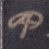
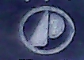
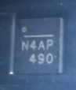
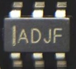
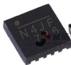

* alpha omega логотип 
* Advanced Power Electronics Corp. -треугольник и полукруг 
* Excelliance power ic логотип в видe 
* UBIQ semiconductor логотип в видe 
* Richtek `=` или пробел
* Nexperia - три линии. В datasheet - "% = placeholder for manufacturing site code" бывает как миниму W или t, например WCM/tCM NX7002AK N-Mosfet.
* monolitic power надчёркивание с точкой или кружком. На меньших полоса справа   

```
Micron GDDR5X 8Gb
MT58K256M321JA-100:A gtx1080 D9VRK,
1080 D9TXS

MT58K256M32JA-110 gtx1080ti D9VRL

Titan XP MT58K256M321JA-120:A  D9VRN 

Micron GDDR5 8Gb
MT51J256M32HF-80:A (2000MHz) D9TCB
MT51J256M32HF-80:B (2000MHz) D9VVR
MT51J256M32HF-70:B (1750MHz) D9VVQ
MT51J256M32HF-70:A (1750MHz) D9SXD
MT51J256M32HF-60:A (1500MHz) D9SXC
MT51K256M32HF-60 N:B (1500MHz) D9VVW
MT51J256M32HF-60S:A (1500MHz) D9TRZ(?)

D9SSX - на RX460, 1750Mhz


Micron GDDR5 4Gb
MT51K128M32HF-60 N:B (1500MHz) D9XDL
```
